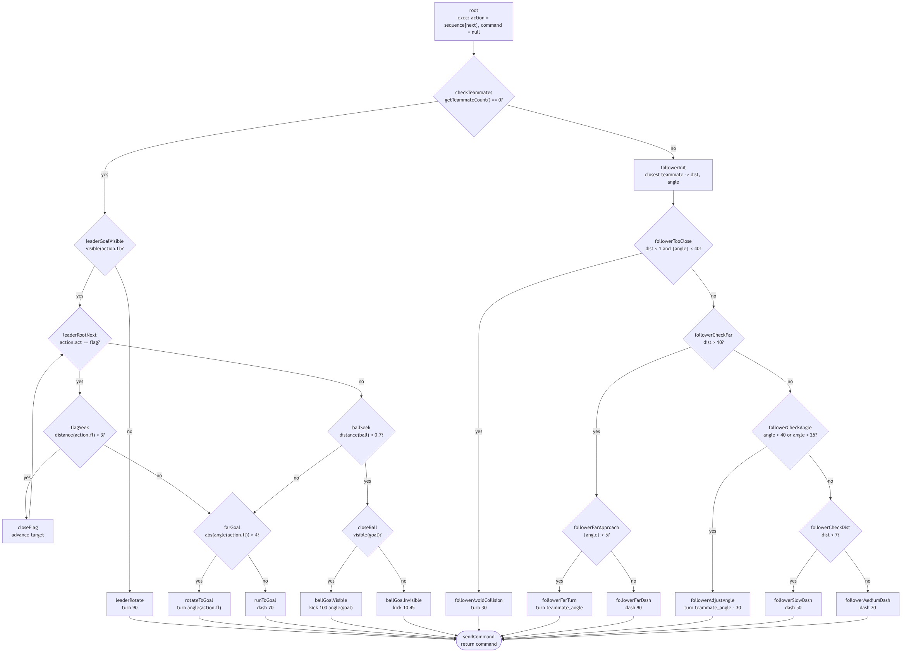
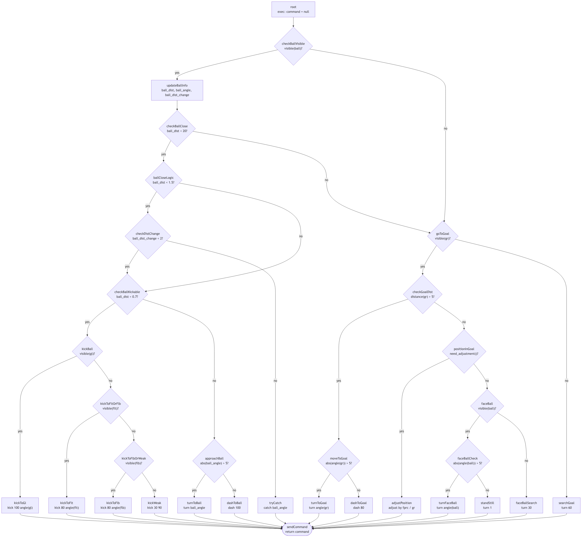

# Отчёт по лабораторной работе №3

## Тема

Управление несколькими игроками виртуального футбола с использованием деревьев решений.

## Цель работы

Целью работы является решение задачи координации действий автономных агентов с использованием деревьев решений.

Для достижения поставленной цели необходимо:

- разработать и подключить механизм обработки деревьев решений;
- разработать деревья решений для управления полевыми игроками и вратарём;
- встроить эти деревья в уже существующего футбольного агента.

## Задание

Необходимо разработать с использованием деревьев решений две программы, имитирующие игрока и вратаря виртуального футбола.

Программа игрока должна решать следующие задачи:

1. Формирование "звена" из двух или трёх игроков. Для "звена" из двух игроков один игрок должен двигаться впереди, второй немного сзади слева. Для "звена" из трёх игроков один игрок движется впереди, двое сзади справа и слева. Выбор места в "звене" должен происходить автономно каждым игроком.
2. Движение игроков в составе "звена" по заданному маршруту, где последним пунктом является забивание мяча в правые ворота.

Программа вратаря должна решать следующие задачи:

1. Защита ворот на правой половине поля.
2. Отбивание мяча командой `kick` и поимка мяча командой `catch`.

## Выполнение работы

В качестве основы была использована предыдущая версия агента, в которой уже были реализованы:

- подключение к серверу виртуального футбола;
- приём и разбор сообщений `init`, `see`, `hear`;
- вычисление координат игрока по видимым флагам;
- вычисление глобальных координат мяча и видимого противника;
- отправка базовых команд серверу.

Поверх этой основы был добавлен механизм деревьев решений и два отдельных дерева: для полевого игрока и для вратаря.

### Общая архитектура решения

Точка входа находится в файле `app.py`. При запуске через аргументы командной строки выбираются:

- имя команды;
- стартовые координаты;
- скорость вращения;
- режим обычного игрока или вратаря;
- маршрут действий полевого игрока.

Основная логика обмена сообщениями с сервером реализована в `agent.py`. Агент:

- регистрируется на сервере;
- выполняет начальное `move`;
- получает сообщения `see` и `hear`;
- вычисляет свои координаты;
- собирает наблюдаемые объекты в удобный словарь;
- передаёт их в контроллер;
- отправляет в сервер команду, полученную от дерева решений.

За выбор дерева и запуск обработки отвечает `controller.py`. Контроллер создаёт:

- дерево игрока из `player_dt.py`, если агент является полевым игроком;
- дерево вратаря из `goalie_dt.py`, если агент запущен с флагом `--goalie`.

### Универсальный механизм исполнения дерева

Для унификации логики был реализован класс `DecisionTree` в файле `decision_tree.py`. Дерево представляется словарём, а его узлы бывают трёх типов:

- `exec` — выполняет вычисления и меняет состояние дерева;
- `condition` — проверяет условие и выбирает одну из двух ветвей;
- `command` — возвращает итоговую команду агенту.

Состояние дерева хранится в `state`. В нём, в зависимости от дерева, содержатся:

- текущий шаг маршрута;
- активная цель;
- последняя подготовленная команда;
- промежуточные вычисленные параметры, например расстояние и угол до сокомандника или до мяча.

Для доступа к информации о том, что видит агент, реализован класс `DTManager` в `dt_manager.py`. Он предоставляет дереву решений набор простых методов:

- `getVisible()` — проверка, виден ли объект;
- `getDistance()` — расстояние до объекта;
- `getAngle()` — угол до объекта;
- `getDistChange()` — изменение расстояния до объекта;
- `getTeammateCount()` — количество видимых сокомандников;
- `getClosestTeammate()` — ближайший сокомандник.

Таким образом, логика принятия решений была отделена от логики сетевого взаимодействия и разбора сообщений сервера.

### Реализация дерева решений полевого игрока

Дерево полевого игрока реализовано в `player_dt.py`. В его основе лежит идея автономного распределения ролей:

- если игрок не видит ни одного сокомандника, он считает себя ведущим;
- если игрок видит хотя бы одного сокомандника, он считает себя ведомым и выстраивается относительно ближайшего партнёра.

#### Логика ведущего игрока

Ведущий игрок движется по маршруту, который хранится в `state["sequence"]`. Маршрут задаётся как последовательность действий вида:

- движение к флагу;
- переход к следующей цели после достижения флага;
- выход к мячу;
- удар по правым воротам.

Алгоритм ведущего построен по образцу из методических указаний:

1. Определяется текущая цель маршрута.
2. Если цель не видна, игрок делает поворот на 90 градусов.
3. Если целью является флаг, игрок:
   - проверяет, достигнут ли флаг;
   - при необходимости разворачивается к нему;
   - иначе выполняет `dash`.
4. Если целью является мяч, игрок:
   - бежит к мячу;
   - при близком расстоянии проверяет, видны ли правые ворота;
   - если ворота видны, бьёт по ним;
   - иначе выполняет слабый удар под фиксированным углом.

За счёт этого первый игрок может самостоятельно вести звено по заданной последовательности ориентиров.

#### Логика ведомого игрока

Если игрок видит сокомандника, включается ветка ведомого. В ней вычисляются:

- расстояние до ближайшего партнёра;
- угол, под которым этот партнёр виден.

Далее используется алгоритм поддержания позиции в "звене" из двух игроков:

1. Если сокомандник слишком близко и почти прямо перед агентом, выполняется поворот для предотвращения столкновения.
2. Если сокомандник далеко, агент либо поворачивается к нему, либо быстро сокращает дистанцию.
3. Если дистанция умеренная, агент корректирует угол так, чтобы держаться примерно под углом около 30 градусов относительно ведущего.
4. После этого выбирается скорость движения: более осторожная на малой дистанции и более активная на большей.

В результате второй игрок удерживается немного сзади и слева от ведущего, что соответствует требованию для "звена" из двух игроков.

Следует отметить, что в текущей реализации полноценно поддержан именно сценарий для двух игроков. Отдельная логика распределения ролей в звене из трёх игроков не была реализована.

### Реализация дерева решений вратаря

Дерево вратаря реализовано в `goalie_dt.py`. Оно разделено на два больших режима:

- игра с мячом, если мяч виден и находится достаточно близко;
- возвращение и позиционирование в воротах, если мяч не виден или находится далеко.

#### Поведение при близком мяче

Если мяч виден, вратарь сохраняет в состояние дерева:

- расстояние до мяча;
- угол на мяч;
- изменение расстояния до мяча.

После этого дерево выполняет следующие проверки:

1. Если мяч очень близко и движется подходящим образом, вратарь пытается поймать его командой `catch`.
2. Если мяч находится в зоне удара, вратарь выполняет `kick`.
3. При ударе приоритет отдаётся воротам противника `gl`.
4. Если ворота не видны, используются боковые ориентиры `flt` и `flb`.
5. Если ни одна хорошая цель не видна, выполняется более слабый удар.
6. Если мяч ещё не находится в зоне удара, вратарь разворачивается к нему или ускоряется в его сторону.

#### Поведение вдали от мяча

Если мяч далеко или отсутствует в поле зрения, вратарь возвращается к правым воротам:

1. Если виден флаг ворот `gr`, проверяется расстояние до него.
2. Если вратарь слишком далеко от ворот, он разворачивается к ним и бежит.
3. Когда позиция около ворот достигнута, выполняется дополнительная корректировка по флагу `fprc`.
4. Если позиция удовлетворительная, вратарь разворачивается в сторону мяча.
5. Если мяч не виден, выполняется небольшой поиск поворотом.

Такой алгоритм позволяет вратарю возвращаться в створ ворот после отбивания мяча и удерживать позицию в центре правых ворот.

## Иллюстрации деревьев решений

На рисунках ниже приведены схемы обоих реализованных деревьев решений.

### Дерево решений полевого игрока

Рисунок 1 — Дерево решений полевого игрока.

### Дерево решений вратаря

Рисунок 2 — Дерево решений вратаря.

## Демонстрация движения звеном

Ниже должен быть размещён скриншот или серия кадров из `rcssmonitor`, показывающих движение двух игроков звеном, где один игрок идёт впереди, а второй удерживается немного сзади слева.

> TODO: вставить сюда скриншот демонстрации движения звеном из `rcssmonitor`.

Рисунок 3 — Демонстрация движения игроков звеном.

## Выводы

В ходе лабораторной работы в существующий футбольный агент был встроен механизм деревьев решений. На его основе были реализованы два специализированных дерева:

- дерево полевого игрока, обеспечивающее прохождение маршрута и координацию двух игроков в звене;
- дерево вратаря, обеспечивающее защиту правых ворот, перехват мяча, его поимку и выбивание.

Дополнительно была сохранена и использована инфраструктура предыдущих лабораторных работ: разбор сообщений сервера, вычисление координат по флагам и формирование глобальных координат наблюдаемых объектов.

В результате получена рабочая схема управления несколькими агентами на основе деревьев решений, пригодная для демонстрации в среде виртуального футбола.
